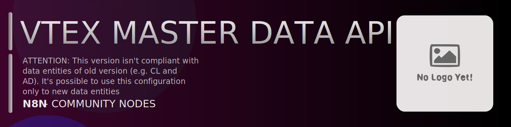

# @n8n-dev/n8n-nodes-vtex-master-data-api



[](https://www.npmjs.com/package/@n8n-dev/n8n-nodes-vtex-master-data-api)
[](https://opensource.org/licenses/MIT)

---

**Stop writing vtex-master-data-api API integrations by hand.**

Every time you connect n8n to vtex-master-data-api, you waste hours mapping endpoints, defining parameters, and debugging schemas. You copy-paste from docs, fix edge cases, and pray nothing breaks.

**What if connecting n8n to vtex-master-data-api took 5 minutes, not half a day?**

This node gives you **9+ resources** out of the box: **Documents**, **Search**, **Scroll**, **Schemas**, **Indices**, and 4 more: with full CRUD operations, typed parameters, and zero manual configuration.

---

## What You Get

- **Zero boilerplate**: Resources, operations, and fields are pre-configured and ready to use
- **Full CRUD**: Create, read, update, and delete support where the API allows it
- **Typed parameters**: No more guessing field types
- **Built-in auth**: API key authentication, ready to go
- **Declarative**: Native n8n performance, no custom execute() overhead

---

## Install

```bash
npm install @n8n-dev/n8n-nodes-vtex-master-data-api
```

**Or in n8n:**
1. **Settings → Community Nodes → Install**
2. Search: `@n8n-dev/n8n-nodes-vtex-master-data-api`
3. Click **Install**

---

## Quick Start

1. Install the node (above)
2. Add credentials: **vtex-master-data-api API** → paste your API key
3. Drag the **vtex-master-data-api** node into your workflow
4. Pick a resource → pick an operation → done.

That's it. No configuration files. No code. It just works.

---

## Resources

| Resource | Operations |
|----------|------------|
| Documents | Patch create partial document, Post create new document, Delete document, Get document, Patch update partial document, Put update entire document |
| Search | Get search documents |
| Scroll | Get scroll documents |
| Schemas | Get schemas, Delete schema by name, Get schema by name, Put save schema by name |
| Indices | Get indices, Put indices, Delete index by name, Get index by name |
| Clusters | Post validate document by clusters |
| Versions | Get list versions, Get version, Put version |
| Customer Profiles | Post create new customer profile, Delete customer profile, Patch update customer profile |
| Addresses | Post create new customer address, Delete customer address, Patch update customer address |

---

## Why This Node?

**Without this node:**
- Hours of manual API integration
- Copy-pasting from vtex-master-data-api docs
- Debugging auth, pagination, error handling
- Maintaining your own client code

**With this node:**
- Install → configure → use. 5 minutes.
- Auto-generated from the official vtex-master-data-api OpenAPI spec
- Always up to date when the API changes
- Native n8n performance

---

## Auto-Generated
This node was auto-generated from the official **vtex-master-data-api** OpenAPI specification using
[@n8n-dev/n8n-openapi-node-ultimate](https://github.com/kelvinzer0/n8n-openapi-node-ultimate),
then validated against the live API so you get accurate types and real parameters, not guesswork.

When the vtex-master-data-api API updates, this node updates too.

---

## Support This Project

If this node saved you hours of work, consider supporting continued development, new APIs, better error handling, and faster updates.

[](https://n8n-code.github.io/membership/#/eyJ0aXRsZSI6IktlZXAgSXQgTW92aW5nIiwiZGVzYyI6Ik9uZSBkZXZlbG9wZXIgYnVpbHQgYSB0b29sIHRoYXQgYXV0by1nZW5lcmF0ZXNcbm44biBub2RlcyBmcm9tIGFueSBPcGVuQVBJIHNwZWMuXG5cbllvdXIgZG9uYXRpb24gZnVuZHMgbmV3IGZlYXR1cmVzLCBtb3JlIEFQSSBzdXBwb3J0LFxuYW5kIGJldHRlciB0b29saW5nIGZvciBldmVyeSBkZXZlbG9wZXIgYWZ0ZXIgeW91LiIsInRhcmdldCI6NTAwMCwiYWRkcmVzc2VzIjp7ImV0aGVyZXVtIjoiMHhmMDU1NWQ0MGRiRkI0ZTNCZjA3MDQ0MjgyQjc4RjJmRTFmNTFFZjcyIiwic29sYW5hIjoiNlpEVk5BYmpZZExEcXo4cGt3VUNHYllaNVV3QlFranB0QzU1Wk5vTFcybVUifSwiZGlzY29yZCI6Imh0dHBzOi8vZGlzY29yZC5nZy9wdERaOGU0aDkzIn0)

---

## License

MIT © [kelvinzer0](https://github.com/n8n-code)
